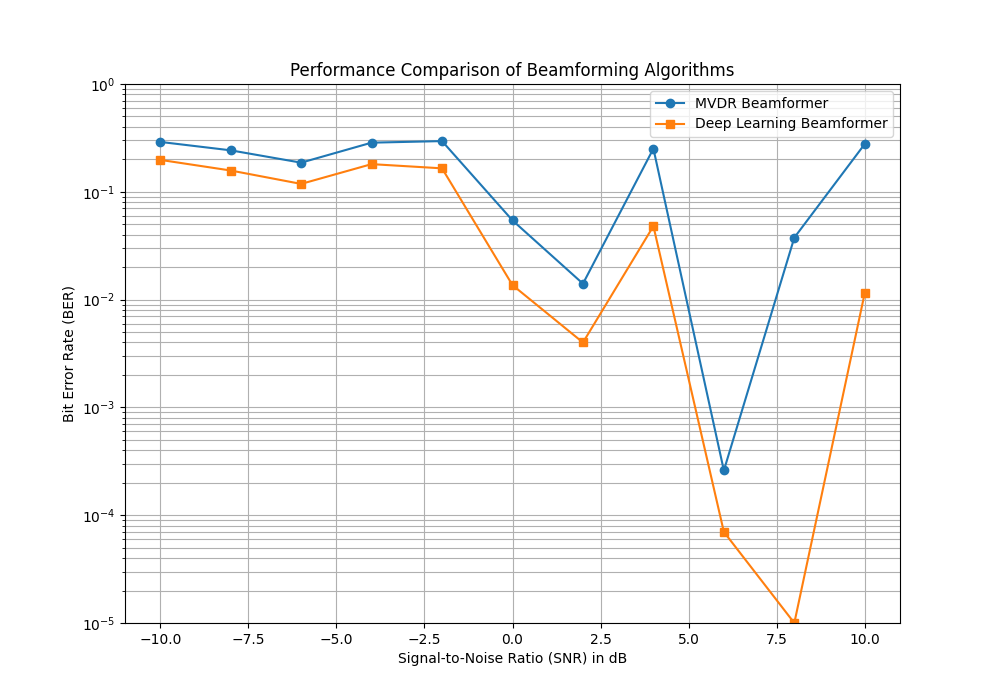

# 5g-beamforming-project

This project is in progress and will design, simulate and evaluate a deep learning-based beamformer for adaptive noise cancellation in a 5G multi-user wireless environment. The performance of the neural network model will be benchmarked against a classical Minimum Variance Distortionless Response (MVDR) beamformer.

The core objective is to mitigate two primary forms of interference in modern wireless communications:

1.  **Additive White Gaussian Noise (AWGN):** Fundamental noise inherent in electronic systems.
2.  **Inter-User Interference (IUI):** Signal corruption caused by other users transmitting on the same frequency in a multi-user scenario.

The simulation will compare the effectiveness of a classical Digital Signal Processing (DSP) algorithm (MVDR) against a deep learning approach in maximising the Signal-to-Interference-plus-Noise Ratio (SINR) for a desired user.

## Background Theory

### The Challenge of Multi-User Interference

In modern 5G wireless systems, a single base station (gNB) must communicate simultaneously with multiple user devices (UEs). The gNB uses an array of antennas to receive signals, but the signal that arrives at this array is a superposition, a mixture of the signals from all users, corrupted by inherent electronic noise. This creates a significant challenge: how to isolate the weak signal of one desired user from the overwhelming interference of all other users transmitting at the same time.

The solution is adaptive beamforming, a signal processing technique that allows the antenna array to "listen" in a specific direction. By intelligently combining the signals received at each antenna, the gNB can form a highly focused beam towards the desired user, enhancing their signal while simultaneously suppressing interfering signals from other directions.

### The System Signal Model

To design a beamformer, we first model the received signal vector, $\mathbf{y}(t)$, at the gNB's antenna array as:

$$
\mathbf{y}(t) = \underbrace{\mathbf{h}_d s_d(t)}_{\text{Desired Signal}} + \underbrace{\sum_{k \neq d}^{K} \mathbf{h}_k s_k(t)}_{\text{Inter-User Interference}} + \underbrace{\mathbf{n}(t)}_{\text{Noise}}
$$

Where:
- $K$ is the total number of users
- $\mathbf{y}(t)$ is the **received signal vector**
- $s_k(t)$ is the **signal transmitted by the k-th user**
- $\mathbf{h}_k$ is the **channel vector** for the k-th user. This vector represents the unique spatial signature of the user's signal path to the antenna array
- $\mathbf{n}(t)$ is the **Additive White Gaussian Noise (AWGN) vector**

The goal of the beamformer is to process $\mathbf{y}(t)$ to recover an accurate estimate of the desired signal, $s_d(t)$

### The MVDR Beamformer: A Classical Solution

The Minimum Variance Distortionless Response (MVDR) beamformer is a widely used algorithm for this task. It calculates an optimal set of weights, $\mathbf{w}$, for the antenna array to minimise the power from interference and noise while maintaining a distortionless response (a gain of 1) in the direction of the desired user

The formula for the MVDR weights is:

$$
\mathbf{w}_{\text{mvdr}} = \frac{\mathbf{R}^{-1}\mathbf{a}(\theta_d)}{\mathbf{a}(\theta_d)^H \mathbf{R}^{-1}\mathbf{a}(\theta_d)}
$$

Where $\mathbf{R}$ is the covariance matrix of the received signal and $\mathbf{a}(\theta_d)$ is the steering vector of the desired user. This project uses the MVDR beamformer as the classical benchmark against which a novel deep learning approach is compared

### A Deep Learning Approach to Beamforming

While the MVDR algorithm provides an optimal solution under specific statistical assumptions, its performance can degrade in complex scenarios where these assumptions do not perfectly hold. An alternative is to treat the beamformer as a "black box" and use a **deep neural network (DNN)** to learn the complex mapping from the received noisy signal to the clean, desired signal

The core idea is to frame beamforming as a **supervised learning problem**:
- **Input:** The raw, complex signal vector received at the antenna array, $\mathbf{y}(t)$
- **Output:** The original, clean symbol transmitted by the desired user, $s_d(t)$

The DNN learns to approximate the ideal function that performs this mapping. Through **training**, the model is shown thousands of examples and iteratively adjusts its internal parameters to minimise the error between its predictions and the true symbols. This data-driven approach allows the model to potentially learn to mitigate impairments that are difficult to model analytically, offering a powerful alternative to classical methods

### Performance Metric: Bit Error Rate (BER)

**Bit Error Rate (BER)** is a fundamental performance metric in digital communications that measures the frequency of errors in a data transmission. It is defined as the ratio of the number of bits that are incorrectly received to the total number of bits transmitted

$$
\text{BER} = \frac{\text{Number of Bit Errors}}{\text{Total Number of Transmitted Bits}}
$$

A lower BER indicates a more reliable, higher-quality communication link. For example, a BER of $10^{-5}$ means that, on average, one bit is incorrect for every 100,000 bits sent. In this project, BER is the primary metric used to compare the effectiveness of the MVDR and deep learning beamformers in recovering the original, error-free signal from the noisy, interfered environment

### Performance Metric: Signal-to-Interference-plus-Noise Ratio (SINR)

The **Signal-to-Interference-plus-Noise Ratio (SINR)** is another key performance metric that measures the quality of a received signal. It is defined as the ratio of the power of the desired signal to the combined power of all interference and noise. A higher SINR value, typically measured in decibels (dB), corresponds to a better quality signal

The output SINR for a beamformer with a weight vector $\mathbf{w}$ is calculated by separating the power of the desired signal, the interference, and the noise:

- **Desired Signal Power:** $P_S = |\mathbf{w}^H \mathbf{h}_d|^2$
- **Interference Power:** $P_I = \sum_{k \neq d} |\mathbf{w}^H \mathbf{h}_k|^2$
- **Noise Power:** $P_N = \sigma^2 ||\mathbf{w}||^2$

The SINR is the ratio of these components:

$$
\text{SINR} = \frac{P_S}{P_I + P_N}
$$

While BER measures the final outcome (errors), SINR provides insight into the quality of the signal at the immediate output of the beamformer before the final bits are decoded.

### Project Sturcture

main.py: Runs the complete project pipeline, from data generation to final evaluation

simulation.py: Generates the 5G multi-user signal data and simulates the wireless channel

models.py: Defines the architectures for both the classical MVDR beamformer and the deep learning model

evaluate.py: Contains functions to calculate key performance metrics like Bit Error Rate (BER)

plotting.py: Includes all functions for creating visualisations, such as constellation and beam pattern plots

### Results and analysis

The performance of the classical MVDR beamformer and the proposed deep learning (DL) model was evaluated across a range of Signal-to-Noise Ratios (SNRs) from -10 dB to +10 dB. The simulation was configured with a 16-antenna array and 8 active users to create a challenging interference environment. The resulting Bit Error Rate (BER) for each model is presented in the figure below.

Key Findings:

Superior Performance of the Deep Learning Model: The deep learning beamformer consistently outperforms the MVDR baseline across the entire SNR range. At an SNR of 0 dB, the DL model achieves a BER of 0.017, over four times lower than the MVDR's BER of 0.074. This demonstrates the model's superior ability to learn and adapt to the complex interference patterns present in a crowded multi-user environment.

Robustness in Challenging Scenarios: A notable anomaly occurred at an SNR of 4 dB, where the MVDR model's performance degraded significantly. This is attributed to a random user placement that likely positioned an interferer very close in angle to the desired user. While the DL model also showed a minor performance dip, its ability to handle this "worst-case" scenario more gracefully highlights its increased robustness compared to the classical algorithm.

Overall Trend: Both models exhibit the expected "waterfall" characteristic, with the BER improving as the signal becomes cleaner (higher SNR). This validates the correctness of the simulation framework. The DL model, however, consistently provides a significant performance gain, achieving a lower error floor more rapidly than the MVDR baseline.

In conclusion, the data-driven approach of the deep learning model proves to be a more effective and robust solution for adaptive beamforming in the simulated high-interference 5G scenario.

## Future Work

This project provides a strong foundation for comparing classical and deep learning-based beamforming. Future work could expand upon this in several key areas to further enhance the simulation's realism and the model's performance:

- **Advanced Channel Models:** Incorporate more complex and realistic channel models beyond the current Line-of-Sight (LoS) simulation, such as Rayleigh or Rician fading, to better represent non-line-of-sight (NLoS) conditions common in urban environments.

- **Hyperparameter Optimisation:** Conduct a systematic hyperparameter tuning process for the deep learning model—exploring different optimisers, learning rates, batch sizes, and network architectures (e.g., adding more layers or neurons), to maximise its performance.

- **Alternative Network Architectures:** Investigate the effectiveness of other neural network architectures that may be better suited for signal processing tasks, such as Convolutional Neural Networks (CNNs) for spatial feature extraction or Complex-Valued Neural Networks that can handle complex numbers natively.

- **Expanded Baselines:** Compare the deep learning model against a wider array of classical beamforming algorithms, such as Zero-Forcing (ZF) or Linear Minimum Mean Square Error (LMMSE), to provide a broader context for its performance.

**Learning resouces**

- Machine Learning for Signal Processing, Max A. Little
- Signal Processing for Communications Paolo Prandoni & Martin Vetterli
- A Brief Introduction to Machine Learning for Engineers by O. Simeone (Foundations and Trends in Signal Processing, 2018)
- Deep Learning by Goodfellow, Bengio & Courville (2016)
- Reinforcement Learning: An Introduction by Sutton & Barto (2018 ed.)
- Tse & Viswanath – Fundamentals of Wireless Communication
- Pattern Recognition and Machine Learning by Bishop (2006)
